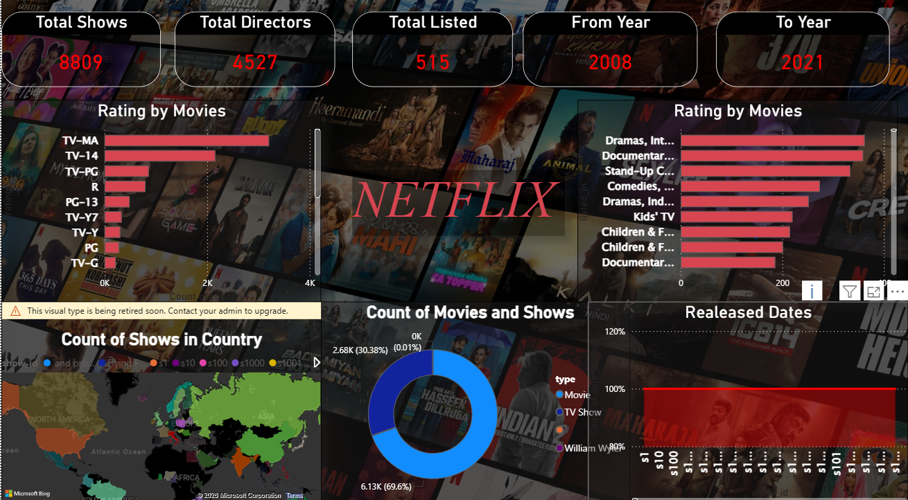

# 🎬 Netflix Analytics Dashboard | Power BI Project

## 🔍 Project Overview
This project analyzes Netflix’s content library using Power BI to uncover trends in content type, ratings, genres, country distribution, and release patterns. The goal is to provide business-friendly insights that help understand platform growth, content strategy, and audience targeting.

---

## 📁 Dataset
The dataset contains information about Netflix movies and TV shows, including:
- Title
- Type (Movie / TV Show)
- Director
- Cast
- Country
- Release Year
- Rating
- Duration
- Genre

---

## 📊 Key Metrics
- Total Shows
- Total Directors
- Total Countries
- Year Range
- Movies vs TV Shows Ratio
- Rating Distribution
- Genre Distribution
- Country-wise Content Count
- Release Year Trends

---

## 📈 Dashboard Highlights
- Rating-wise content distribution
- Genre-wise content analysis
- Country-wise availability
- Movies vs TV shows split
- Content release trends over time

---

## 💡 Business Insights
- Netflix focuses heavily on specific genres such as Drama and Comedy.
- TV-MA and TV-14 ratings dominate the platform.
- Content production has significantly increased after 2015.
- The US and India contribute major portions of the content library.
- Movies form a larger share compared to TV Shows.

---

## 🛠 Tools Used
- Power BI
- CSV / Excel
- GitHub

---

## 📷 Dashboard Preview

---

## 🚀 How to Use
1. Download the `.pbix` file from `powerbi_file/`
2. Open in Power BI Desktop
3. Connect to the dataset inside `data/`
4. Explore interactive visuals

---

## 👤 Author
**Sumit Solanki**  
Aspiring Data Analyst | Power BI | Tableau | SQL | Python
